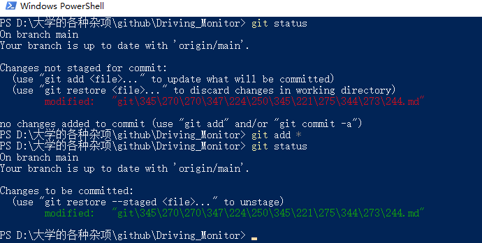

## GIT 常用命令

#### 将远程仓库复制到本地

###### git clone

就是将库复制到本地。

#### 重要命令

###### git status

查看本地库的状态，有什么修改，或者待提交的文件。

###### git pull

拉取远程仓库，可以理解为更新本地仓库，远程仓库被其他人修改后就需要拉取，但是默认在写代码前先git pull一下以确保是最新代码。

#### 修改文件后上传的操作三部曲（第一次执行的时候需要配置用户）

###### git add *

这一步是将所有修改的文件都加入到准备提交的缓存中，*可以替换为对应文件。

###### git commit -m 'update'

这一步是提交，将上一步add的文件提交到本地库，update可以修改为简单备注。

###### git push origin main

这一步是将之前提交的文件推送到远程仓库，将会修改远程仓库。

origin是远程库，main是该远程库的主分支，这里咱们直接用主分支就好。